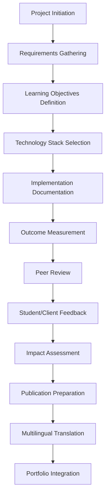
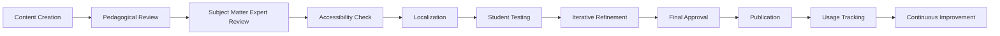
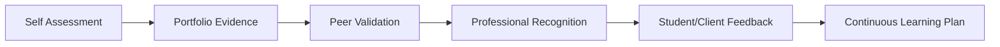
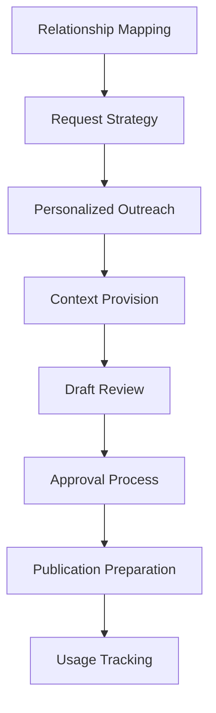
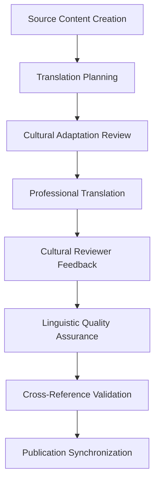

# Educator & Creative Professional Portfolio Workflows

## Overview
This document outlines specialized CMS workflows designed specifically for Brandon's needs as an educator and creative professional. These workflows reflect how educators and creatives actually work, with built-in collaboration, peer review, and iterative improvement processes.

## 1. Project Showcase Workflow

### Purpose
Comprehensive documentation of educational projects, case studies, and outcomes with technology integration details.

### Workflow Steps


### Content Structure
- **Project Metadata**
  - Title (EN/ES)
  - Duration
  - Audience (age/level)
  - Context (institution/program)
  - Collaboration partners

- **Learning Design**
  - Learning objectives
  - Assessment criteria
  - Pedagogical approach
  - Technology integration rationale

- **Implementation Details**
  - Technology stack
  - Development timeline
  - Challenges encountered
  - Solutions implemented

- **Outcomes & Impact**
  - Quantitative metrics (engagement, completion rates, test scores)
  - Qualitative feedback
  - Long-term impact tracking
  - Lessons learned

### Workflow Templates
- **EdTech Project Template**
- **Curriculum Design Template** 
- **VR/AR Learning Experience Template**
- **AI Integration Case Study Template**

## 2. Teaching Materials Management Workflow

### Purpose
Systematic organization and version control of educational resources, courses, and lesson materials.

### Workflow Categories
- **Course Development**
- **Lesson Planning**  
- **Assessment Creation**
- **Resource Curation**
- **Student Work Evaluation**

### Content Lifecycle


### Metadata Schema
- **Educational Level**: Elementary, Secondary, University, Professional
- **Subject Area**: Language Learning, Technology, Pedagogy
- **Skills Targeted**: Speaking, Writing, Critical Thinking, etc.
- **Technology Requirements**: VR headsets, AI tools, mobile apps
- **Differentiation Notes**: For diverse learners
- **Assessment Alignment**: Standards and competencies

## 3. Creative Writing Workflow

### Purpose
Professional management of poetry, prose, and creative works with specialized formatting and multilingual support.

### Writing Categories
- **Poetry (Poesía)**
  - Free verse
  - Structured forms
  - Bilingual compositions
  - Visual poetry

- **Prose**
  - Short stories
  - Creative non-fiction
  - Travel writing
  - Reflective essays

### Editorial Process
```mermaid
graph TD
    A[Initial Draft] --> B[Self-Review]
    B --> C[Peer Workshop]
    C --> D[Revision Round 1]
    D --> E[Editorial Review]
    E --> F[Revision Round 2]
    F --> G[Final Proofing]
    G --> H[Format Preparation]
    H --> I[Translation (if applicable)]
    I --> J[Publication]
```

### Special Features
- **Version Tracking**: Draft progression with diff views
- **Collaboration Tools**: Peer review and commenting
- **Format Preservation**: Spacing, line breaks, visual elements
- **Submission Tracking**: Publications, contests, readings
- **Performance Notes**: Reading events, recordings

## 4. Professional Experience Timeline Management

### Purpose
Dynamic documentation of career progression with context-rich storytelling and impact measurement.

### Timeline Structure
- **Chronological View**: Year-by-year progression
- **Thematic View**: By role type or skill development
- **Impact View**: Major achievements and outcomes
- **Project View**: Cross-institutional collaborations

### Experience Documentation
```yaml
position:
  title: "Senior Curriculum Designer"
  organization: "VIPKID"
  duration: "2019-2022"
  location: "Remote (Beijing-based company)"
  
context:
  scale: "800,000+ young learners"
  market: "Chinese ESL market"
  team_size: "15-person curriculum team"
  
responsibilities:
  - "Curriculum scoping and learning objective design"
  - "AI-assisted content personalization"
  - "Cross-cultural learning experience design"
  
achievements:
  quantitative:
    - metric: "Student engagement increase"
      value: "35%"
      measurement: "Platform analytics"
    - metric: "Course completion rates"
      value: "92%"
      measurement: "Learning management system"
  
  qualitative:
    - "Pioneered VR integration for immersive language learning"
    - "Mentored 8 junior designers in pedagogical best practices"
    
technologies:
  primary: ["Unity", "React", "Node.js", "PostgreSQL"]
  ai_ml: ["TensorFlow", "OpenAI API", "Custom NLP models"]
  
impact_story: |
  Led the transformation from traditional lesson formats to 
  adaptive, AI-powered learning experiences that responded 
  to individual student needs and cultural contexts.

portfolio_artifacts:
  - "Case study: VR Immersion Program Development"
  - "White paper: AI in Language Learning Design"
  - "Video: Behind-the-scenes curriculum design process"
```

## 5. Skills Matrix with Proficiency Levels

### Purpose
Evidence-based skill tracking with peer validation and continuous learning documentation.

### Skill Categories
- **Technical Skills**
  - Programming languages
  - Frameworks and tools
  - AI/ML platforms
  - Educational technology

- **Pedagogical Skills**
  - Curriculum design
  - Assessment development
  - Differentiated instruction
  - Technology integration

- **Language Skills**
  - English (native)
  - Spanish (advanced)
  - Cultural competency

- **Creative Skills**
  - Writing and composition
  - Visual design
  - Photography
  - Performance

### Proficiency Validation


### Evidence Types
- **Project Portfolios**: Demonstrable work samples
- **Certifications**: Formal credentials and training
- **Peer Reviews**: Colleague endorsements
- **Student Outcomes**: Learning impact data
- **Publications**: Research and thought leadership
- **Speaking Engagements**: Conference presentations

## 6. Testimonial & Recommendation System

### Purpose
Structured collection and management of professional endorsements with verification and context.

### Testimonial Categories
- **Student Testimonials**
  - Learning impact stories
  - Personal growth narratives
  - Long-term career influence

- **Colleague Endorsements**
  - Collaboration experiences
  - Professional competencies
  - Leadership examples

- **Client Recommendations**
  - Project success stories
  - Problem-solving capabilities
  - Innovation examples

- **Supervisor Evaluations**
  - Performance assessments
  - Growth and development
  - Strategic contributions

### Collection Workflow


### Quality Assurance
- **Authenticity Verification**: Contact information validation
- **Context Documentation**: Relationship details and timeframes
- **Impact Quantification**: Specific examples and metrics
- **Diversity Representation**: Various perspectives and backgrounds
- **Regular Updates**: Refreshing older testimonials

## 7. Multilingual Content Synchronization

### Purpose
Seamless management of content across English and Spanish with cultural adaptation and consistency maintenance.

### Translation Workflow


### Content Synchronization Features
- **Linked Content Management**: Automatic relationship tracking
- **Version Control**: Translation versioning with source changes
- **Cultural Notes**: Context for cultural adaptations
- **SEO Optimization**: Language-specific keyword research
- **Regional Customization**: Colombia vs. US market adaptation

### Quality Control
- **Translation Memory**: Consistency across documents
- **Glossary Management**: Technical and educational term standardization
- **Review Cycles**: Native speaker validation
- **Cultural Sensitivity**: Regional appropriateness review

## Implementation Recommendations

### Phase 1: Core Infrastructure
1. Extend existing WorkflowState model with education-specific workflow types
2. Create custom content types for educational materials
3. Implement specialized metadata schemas
4. Build multilingual content linking system

### Phase 2: Workflow Automation
1. Automated peer review assignments
2. Progress tracking and deadline management
3. Quality assurance checkpoints
4. Notification systems for stakeholders

### Phase 3: Advanced Features
1. AI-powered content suggestions
2. Impact measurement tracking
3. Collaborative editing tools
4. Advanced analytics and reporting

### Integration Points
- **Hugo CMS**: Content structure and templating
- **Database**: Workflow state and relationship management
- **External APIs**: Translation services, plagiarism detection
- **Analytics**: Impact measurement and engagement tracking

---

*This workflow system is designed to reflect the authentic work patterns of educators and creative professionals, emphasizing collaboration, iteration, and continuous improvement.*