# Portfolio Site Migration Setup Guide

## Table of Contents
1. [Overview](#overview)
2. [Prerequisites and Requirements](#prerequisites-and-requirements)
3. [Architecture Overview](#architecture-overview)
4. [Step-by-Step Migration Instructions](#step-by-step-migration-instructions)
5. [Database Schema](#database-schema)
6. [Verification Steps](#verification-steps)
7. [Troubleshooting Common Issues](#troubleshooting-common-issues)
8. [Rollback Procedures](#rollback-procedures)
9. [Performance Optimization](#performance-optimization)
10. [Security Considerations](#security-considerations)
11. [Monitoring and Maintenance](#monitoring-and-maintenance)

---

## Overview

This guide provides comprehensive instructions for migrating the portfolio site from Hugo to a modern Next.js 14 application with Supabase backend. The migration preserves all existing content while enhancing functionality with real-time capabilities, authentication, and a powerful admin panel.

### Migration Goals
- Preserve all existing Hugo content and media
- Implement modern React-based frontend with Next.js 14
- Add real-time capabilities via Supabase
- Integrate Auth0 for authentication
- Deploy on Vercel with edge optimization
- Maintain SEO and performance standards

### Technology Stack
- **Frontend**: Next.js 14 (App Router)
- **Backend**: Supabase (PostgreSQL, Real-time, Storage)
- **Authentication**: Auth0
- **CMS**: Decap CMS (formerly Netlify CMS)
- **Deployment**: Vercel
- **Monitoring**: Vercel Analytics

---

## Prerequisites and Requirements

### System Requirements
```bash
# Required versions
Node.js: >= 18.17.0
npm: >= 9.0.0
Git: >= 2.35.0

# Verify installations
node --version
npm --version
git --version
```

### Required Accounts
1. **Supabase Account**
   - Create at: https://supabase.com
   - Free tier sufficient for development
   - Note project URL and anon key

2. **Auth0 Account**
   - Create at: https://auth0.com
   - Configure application type: "Single Page Application"
   - Note domain, client ID, and client secret

3. **Vercel Account**
   - Create at: https://vercel.com
   - Connect GitHub repository
   - Configure environment variables

### Local Development Tools
```bash
# Install global tools
npm install -g vercel
npm install -g supabase
npm install -g @supabase/cli

# Verify installations
vercel --version
supabase --version
```

### Environment Variables Template
Create `.env.local`:
```env
# Supabase Configuration
NEXT_PUBLIC_SUPABASE_URL=https://[PROJECT_ID].supabase.co
NEXT_PUBLIC_SUPABASE_ANON_KEY=[YOUR_ANON_KEY]
SUPABASE_SERVICE_ROLE_KEY=[YOUR_SERVICE_KEY]

# Auth0 Configuration
AUTH0_DOMAIN=[YOUR_AUTH0_DOMAIN]
AUTH0_CLIENT_ID=[YOUR_CLIENT_ID]
AUTH0_CLIENT_SECRET=[YOUR_CLIENT_SECRET]
AUTH0_SCOPE=openid profile email
NEXTAUTH_URL=http://localhost:3000
NEXTAUTH_SECRET=[GENERATE_RANDOM_SECRET]

# Vercel Configuration (Production)
VERCEL_URL=[YOUR_VERCEL_URL]
VERCEL_ENV=production
```

---

## Architecture Overview

### System Components


### Data Flow
1. **Content Creation**: Authors use Decap CMS → Git → Supabase
2. **User Authentication**: Auth0 → JWT → Session → API Access
3. **Real-time Updates**: Database Changes → WebSocket → Client Updates
4. **Media Handling**: Upload → Supabase Storage → CDN → Optimized Delivery

---

## Step-by-Step Migration Instructions

### Phase 1: Project Setup

#### 1.1 Initialize Next.js Project
```bash
# Clone or create new project
git clone [YOUR_REPO_URL] portfolio-nextjs
cd portfolio-nextjs

# Install dependencies
npm install

# Verify Next.js setup
npm run dev
# Visit http://localhost:3000
```

#### 1.2 Configure Supabase
```bash
# Initialize Supabase locally
supabase init

# Link to remote project
supabase link --project-ref [PROJECT_ID]

# Pull remote schema
supabase db pull

# Generate TypeScript types
supabase gen types typescript --local > types/supabase.ts
```

#### 1.3 Set Up Database Schema
```sql
-- Run in Supabase SQL Editor
-- Location: supabase/migrations/[timestamp]_initial_schema.sql

-- Enable necessary extensions
CREATE EXTENSION IF NOT EXISTS "uuid-ossp";
CREATE EXTENSION IF NOT EXISTS "pgcrypto";

-- Create content tables
CREATE TABLE public.posts (
    id UUID PRIMARY KEY DEFAULT uuid_generate_v4(),
    title TEXT NOT NULL,
    slug TEXT UNIQUE NOT NULL,
    content TEXT,
    excerpt TEXT,
    featured_image TEXT,
    author_id UUID REFERENCES auth.users(id),
    status TEXT DEFAULT 'draft',
    published_at TIMESTAMPTZ,
    meta JSONB DEFAULT '{}',
    tags TEXT[] DEFAULT '{}',
    created_at TIMESTAMPTZ DEFAULT NOW(),
    updated_at TIMESTAMPTZ DEFAULT NOW()
);

CREATE TABLE public.projects (
    id UUID PRIMARY KEY DEFAULT uuid_generate_v4(),
    title TEXT NOT NULL,
    slug TEXT UNIQUE NOT NULL,
    description TEXT,
    content TEXT,
    featured_image TEXT,
    project_url TEXT,
    github_url TEXT,
    technologies TEXT[] DEFAULT '{}',
    status TEXT DEFAULT 'active',
    display_order INTEGER DEFAULT 0,
    meta JSONB DEFAULT '{}',
    created_at TIMESTAMPTZ DEFAULT NOW(),
    updated_at TIMESTAMPTZ DEFAULT NOW()
);

CREATE TABLE public.media (
    id UUID PRIMARY KEY DEFAULT uuid_generate_v4(),
    filename TEXT NOT NULL,
    original_name TEXT,
    mime_type TEXT,
    size INTEGER,
    url TEXT NOT NULL,
    thumbnail_url TEXT,
    alt_text TEXT,
    caption TEXT,
    metadata JSONB DEFAULT '{}',
    uploaded_by UUID REFERENCES auth.users(id),
    created_at TIMESTAMPTZ DEFAULT NOW()
);

-- Create indexes for performance
CREATE INDEX idx_posts_slug ON posts(slug);
CREATE INDEX idx_posts_status ON posts(status);
CREATE INDEX idx_posts_published ON posts(published_at DESC);
CREATE INDEX idx_projects_slug ON projects(slug);
CREATE INDEX idx_projects_order ON projects(display_order);
CREATE INDEX idx_media_uploaded_by ON media(uploaded_by);

-- Set up Row Level Security
ALTER TABLE posts ENABLE ROW LEVEL SECURITY;
ALTER TABLE projects ENABLE ROW LEVEL SECURITY;
ALTER TABLE media ENABLE ROW LEVEL SECURITY;

-- Public read access
CREATE POLICY "Public posts readable" ON posts
    FOR SELECT USING (status = 'published');

CREATE POLICY "Public projects readable" ON projects
    FOR SELECT USING (status = 'active');

CREATE POLICY "Public media readable" ON media
    FOR SELECT USING (true);

-- Authenticated write access
CREATE POLICY "Authenticated users can create posts" ON posts
    FOR INSERT WITH CHECK (auth.uid() IS NOT NULL);

CREATE POLICY "Authenticated users can update own posts" ON posts
    FOR UPDATE USING (auth.uid() = author_id);

CREATE POLICY "Authenticated users can delete own posts" ON posts
    FOR DELETE USING (auth.uid() = author_id);
```

### Phase 2: Content Migration

#### 2.1 Export Hugo Content
```javascript
// scripts/hugo-export.js
const fs = require('fs');
const path = require('path');
const matter = require('gray-matter');
const { createClient } = require('@supabase/supabase-js');

const supabase = createClient(
    process.env.NEXT_PUBLIC_SUPABASE_URL,
    process.env.SUPABASE_SERVICE_ROLE_KEY
);

async function migrateHugoContent() {
    const contentDir = './content'; // Hugo content directory
    const posts = [];
    
    // Read all markdown files
    const files = fs.readdirSync(contentDir);
    
    for (const file of files) {
        if (file.endsWith('.md')) {
            const filePath = path.join(contentDir, file);
            const fileContent = fs.readFileSync(filePath, 'utf8');
            const { data, content } = matter(fileContent);
            
            posts.push({
                title: data.title,
                slug: file.replace('.md', ''),
                content: content,
                excerpt: data.description || content.substring(0, 200),
                featured_image: data.image,
                status: data.draft ? 'draft' : 'published',
                published_at: data.date,
                tags: data.tags || [],
                meta: {
                    original_hugo_data: data
                }
            });
        }
    }
    
    // Insert into Supabase
    const { data, error } = await supabase
        .from('posts')
        .insert(posts);
    
    if (error) {
        console.error('Migration error:', error);
    } else {
        console.log(`Successfully migrated ${posts.length} posts`);
    }
}

// Run migration
migrateHugoContent();
```

#### 2.2 Migrate Media Assets
```javascript
// scripts/migrate-media.js
const fs = require('fs');
const path = require('path');
const { createClient } = require('@supabase/supabase-js');

const supabase = createClient(
    process.env.NEXT_PUBLIC_SUPABASE_URL,
    process.env.SUPABASE_SERVICE_ROLE_KEY
);

async function migrateMedia() {
    const mediaDir = './static/images'; // Hugo static directory
    const bucket = 'portfolio-media';
    
    // Create bucket if not exists
    const { data: buckets } = await supabase.storage.listBuckets();
    if (!buckets.find(b => b.name === bucket)) {
        await supabase.storage.createBucket(bucket, { public: true });
    }
    
    // Upload files
    const files = fs.readdirSync(mediaDir);
    for (const file of files) {
        const filePath = path.join(mediaDir, file);
        const fileContent = fs.readFileSync(filePath);
        
        const { data, error } = await supabase.storage
            .from(bucket)
            .upload(file, fileContent, {
                contentType: getContentType(file)
            });
        
        if (error) {
            console.error(`Error uploading ${file}:`, error);
        } else {
            console.log(`Uploaded: ${file}`);
            
            // Get public URL
            const { data: { publicUrl } } = supabase.storage
                .from(bucket)
                .getPublicUrl(file);
            
            // Store in media table
            await supabase.from('media').insert({
                filename: file,
                original_name: file,
                url: publicUrl,
                mime_type: getContentType(file),
                size: fileContent.length
            });
        }
    }
}

function getContentType(filename) {
    const ext = path.extname(filename).toLowerCase();
    const types = {
        '.jpg': 'image/jpeg',
        '.jpeg': 'image/jpeg',
        '.png': 'image/png',
        '.gif': 'image/gif',
        '.webp': 'image/webp',
        '.svg': 'image/svg+xml'
    };
    return types[ext] || 'application/octet-stream';
}

// Run migration
migrateMedia();
```

### Phase 3: Application Setup

#### 3.1 Configure Next.js App Structure
```typescript
// app/layout.tsx
import { Inter } from 'next/font/google'
import { Providers } from './providers'
import { Navigation } from '@/components/navigation'
import { Analytics } from '@vercel/analytics/react'
import './globals.css'

const inter = Inter({ subsets: ['latin'] })

export const metadata = {
    title: 'Portfolio Site',
    description: 'Professional portfolio and blog',
}

export default function RootLayout({
    children,
}: {
    children: React.ReactNode
}) {
    return (
        <html lang="en">
            <body className={inter.className}>
                <Providers>
                    <Navigation />
                    <main>{children}</main>
                    <Analytics />
                </Providers>
            </body>
        </html>
    )
}
```

#### 3.2 Set Up API Routes
```typescript
// app/api/posts/route.ts
import { createRouteHandlerClient } from '@supabase/auth-helpers-nextjs'
import { cookies } from 'next/headers'
import { NextResponse } from 'next/server'

export async function GET(request: Request) {
    const { searchParams } = new URL(request.url)
    const page = parseInt(searchParams.get('page') || '1')
    const limit = parseInt(searchParams.get('limit') || '10')
    const offset = (page - 1) * limit
    
    const supabase = createRouteHandlerClient({ cookies })
    
    const { data: posts, error, count } = await supabase
        .from('posts')
        .select('*', { count: 'exact' })
        .eq('status', 'published')
        .order('published_at', { ascending: false })
        .range(offset, offset + limit - 1)
    
    if (error) {
        return NextResponse.json({ error: error.message }, { status: 500 })
    }
    
    return NextResponse.json({
        posts,
        pagination: {
            page,
            limit,
            total: count,
            pages: Math.ceil((count || 0) / limit)
        }
    })
}

export async function POST(request: Request) {
    const supabase = createRouteHandlerClient({ cookies })
    
    // Check authentication
    const { data: { session } } = await supabase.auth.getSession()
    if (!session) {
        return NextResponse.json({ error: 'Unauthorized' }, { status: 401 })
    }
    
    const body = await request.json()
    
    const { data, error } = await supabase
        .from('posts')
        .insert({
            ...body,
            author_id: session.user.id
        })
        .select()
        .single()
    
    if (error) {
        return NextResponse.json({ error: error.message }, { status: 500 })
    }
    
    return NextResponse.json(data, { status: 201 })
}
```

#### 3.3 Implement Real-time Subscriptions
```typescript
// hooks/useRealtimePosts.ts
import { useEffect, useState } from 'react'
import { createClientComponentClient } from '@supabase/auth-helpers-nextjs'

export function useRealtimePosts() {
    const [posts, setPosts] = useState([])
    const supabase = createClientComponentClient()
    
    useEffect(() => {
        // Initial fetch
        const fetchPosts = async () => {
            const { data } = await supabase
                .from('posts')
                .select('*')
                .eq('status', 'published')
                .order('published_at', { ascending: false })
            
            setPosts(data || [])
        }
        
        fetchPosts()
        
        // Set up real-time subscription
        const channel = supabase
            .channel('posts-changes')
            .on('postgres_changes', 
                { event: '*', schema: 'public', table: 'posts' },
                (payload) => {
                    if (payload.eventType === 'INSERT') {
                        setPosts(prev => [payload.new, ...prev])
                    } else if (payload.eventType === 'UPDATE') {
                        setPosts(prev => prev.map(post => 
                            post.id === payload.new.id ? payload.new : post
                        ))
                    } else if (payload.eventType === 'DELETE') {
                        setPosts(prev => prev.filter(post => 
                            post.id !== payload.old.id
                        ))
                    }
                }
            )
            .subscribe()
        
        return () => {
            supabase.removeChannel(channel)
        }
    }, [supabase])
    
    return posts
}
```

### Phase 4: Authentication Integration

#### 4.1 Configure Auth0
```typescript
// lib/auth0.ts
import { initAuth0 } from '@auth0/nextjs-auth0'

export default initAuth0({
    baseURL: process.env.NEXTAUTH_URL,
    issuerBaseURL: `https://${process.env.AUTH0_DOMAIN}`,
    secret: process.env.NEXTAUTH_SECRET,
    clientID: process.env.AUTH0_CLIENT_ID,
    clientSecret: process.env.AUTH0_CLIENT_SECRET,
    scope: 'openid profile email',
    routes: {
        callback: '/api/auth/callback',
        login: '/api/auth/login',
        logout: '/api/auth/logout',
    },
    session: {
        cookie: {
            secure: process.env.NODE_ENV === 'production',
            sameSite: 'lax',
            httpOnly: true
        }
    }
})
```

#### 4.2 Protect Admin Routes
```typescript
// middleware.ts
import { withMiddlewareAuthRequired } from '@auth0/nextjs-auth0/edge'
import { NextResponse } from 'next/server'
import type { NextRequest } from 'next/server'

export default withMiddlewareAuthRequired(async function middleware(req: NextRequest) {
    // Additional authorization logic
    const res = NextResponse.next()
    return res
})

export const config = {
    matcher: ['/admin/:path*', '/api/admin/:path*']
}
```

### Phase 5: Deployment

#### 5.1 Prepare for Production
```bash
# Build optimization
npm run build

# Test production build locally
npm run start

# Run lighthouse audit
npx lighthouse http://localhost:3000 --view
```

#### 5.2 Deploy to Vercel
```bash
# Install Vercel CLI
npm i -g vercel

# Deploy to preview
vercel

# Deploy to production
vercel --prod

# Set environment variables
vercel env add NEXT_PUBLIC_SUPABASE_URL
vercel env add NEXT_PUBLIC_SUPABASE_ANON_KEY
vercel env add SUPABASE_SERVICE_ROLE_KEY
vercel env add AUTH0_DOMAIN
vercel env add AUTH0_CLIENT_ID
vercel env add AUTH0_CLIENT_SECRET
```

#### 5.3 Configure Custom Domain
```bash
# Add custom domain
vercel domains add your-domain.com

# Verify DNS settings
vercel domains verify your-domain.com
```

---

## Database Schema

### Entity Relationship Diagram

```mermaid
erDiagram
    USERS ||--o{ POSTS : creates
    USERS ||--o{ MEDIA : uploads
    POSTS ||--o{ POST_TAGS : has
    TAGS ||--o{ POST_TAGS : belongs
    PROJECTS ||--o{ PROJECT_TECH : uses
    TECHNOLOGIES ||--o{ PROJECT_TECH : belongs
    
    USERS {
        uuid id PK
        text email
        text name
        text avatar_url
        jsonb metadata
        timestamp created_at
    }
    
    POSTS {
        uuid id PK
        text title
        text slug UK
        text content
        text excerpt
        text featured_image
        uuid author_id FK
        text status
        timestamp published_at
        jsonb meta
        text[] tags
        timestamp created_at
        timestamp updated_at
    }
    
    PROJECTS {
        uuid id PK
        text title
        text slug UK
        text description
        text content
        text featured_image
        text project_url
        text github_url
        text[] technologies
        text status
        integer display_order
        jsonb meta
        timestamp created_at
        timestamp updated_at
    }
    
    MEDIA {
        uuid id PK
        text filename
        text original_name
        text mime_type
        integer size
        text url
        text thumbnail_url
        text alt_text
        text caption
        jsonb metadata
        uuid uploaded_by FK
        timestamp created_at
    }
    
    TAGS {
        uuid id PK
        text name UK
        text slug UK
        text description
        integer usage_count
        timestamp created_at
    }
    
    TECHNOLOGIES {
        uuid id PK
        text name UK
        text category
        text icon
        text color
        timestamp created_at
    }
```


### Key Relationships
- **Users → Posts**: One-to-Many (Author relationship)
- **Users → Media**: One-to-Many (Upload tracking)
- **Posts → Tags**: Many-to-Many (Via junction table)
- **Projects → Technologies**: Many-to-Many (Via junction table)

### Indexing Strategy
```sql
-- Performance indexes
CREATE INDEX idx_posts_slug ON posts(slug);
CREATE INDEX idx_posts_status_published ON posts(status, published_at DESC);
CREATE INDEX idx_posts_author ON posts(author_id);
CREATE INDEX idx_posts_tags ON posts USING GIN(tags);
CREATE INDEX idx_projects_display ON projects(display_order, status);
CREATE INDEX idx_media_mime ON media(mime_type);
CREATE INDEX idx_posts_fulltext ON posts USING GIN(to_tsvector('english', title || ' ' || coalesce(content, '')));
```

---

## Verification Steps

### 1. Database Verification
```sql
-- Check table creation
SELECT table_name FROM information_schema.tables 
WHERE table_schema = 'public';

-- Verify row counts
SELECT 
    'posts' as table_name, COUNT(*) as count FROM posts
UNION ALL
SELECT 
    'projects', COUNT(*) FROM projects
UNION ALL
SELECT 
    'media', COUNT(*) FROM media;

-- Check RLS policies
SELECT 
    schemaname,
    tablename,
    policyname,
    permissive,
    roles,
    cmd,
    qual
FROM pg_policies
WHERE schemaname = 'public';
```

### 2. Application Testing
```typescript
// tests/integration/api.test.ts
import { createClient } from '@supabase/supabase-js'

describe('API Integration', () => {
    let supabase
    
    beforeAll(() => {
        supabase = createClient(
            process.env.NEXT_PUBLIC_SUPABASE_URL,
            process.env.NEXT_PUBLIC_SUPABASE_ANON_KEY
        )
    })
    
    test('Can fetch published posts', async () => {
        const { data, error } = await supabase
            .from('posts')
            .select('*')
            .eq('status', 'published')
        
        expect(error).toBeNull()
        expect(Array.isArray(data)).toBe(true)
    })
    
    test('Can fetch active projects', async () => {
        const { data, error } = await supabase
            .from('projects')
            .select('*')
            .eq('status', 'active')
        
        expect(error).toBeNull()
        expect(Array.isArray(data)).toBe(true)
    })
})
```

### 3. Performance Verification
```javascript
// scripts/performance-check.js
const lighthouse = require('lighthouse');
const chromeLauncher = require('chrome-launcher');

async function runLighthouse(url) {
    const chrome = await chromeLauncher.launch({chromeFlags: ['--headless']});
    const options = {
        logLevel: 'info',
        output: 'json',
        onlyCategories: ['performance', 'accessibility', 'seo'],
        port: chrome.port
    };
    
    const runnerResult = await lighthouse(url, options);
    
    console.log('Performance score:', runnerResult.lhr.categories.performance.score * 100);
    console.log('Accessibility score:', runnerResult.lhr.categories.accessibility.score * 100);
    console.log('SEO score:', runnerResult.lhr.categories.seo.score * 100);
    
    await chrome.kill();
}

runLighthouse('http://localhost:3000');
```

### 4. SEO Verification
```bash
# Check meta tags
curl -s http://localhost:3000 | grep -E '<meta|<title'

# Check sitemap
curl http://localhost:3000/sitemap.xml

# Check robots.txt
curl http://localhost:3000/robots.txt

# Check structured data
npx schema-org-validator http://localhost:3000
```

---

## Troubleshooting Common Issues

### Issue 1: Database Connection Errors
```javascript
// Problem: "Connection refused" or timeout errors
// Solution: Check environment variables and network

// Debug script
const { createClient } = require('@supabase/supabase-js')

const supabase = createClient(
    process.env.NEXT_PUBLIC_SUPABASE_URL,
    process.env.NEXT_PUBLIC_SUPABASE_ANON_KEY
)

async function testConnection() {
    try {
        const { data, error } = await supabase.from('posts').select('count')
        if (error) throw error
        console.log('Connection successful:', data)
    } catch (error) {
        console.error('Connection failed:', error.message)
        console.log('Check:')
        console.log('1. Environment variables are set correctly')
        console.log('2. Supabase project is running')
        console.log('3. Network allows connection to Supabase')
    }
}

testConnection()
```

### Issue 2: Authentication Failures
```typescript
// Problem: Users can't log in or sessions expire
// Solution: Verify Auth0 configuration

// Debug authentication
import auth0 from '@/lib/auth0'

export async function GET(request: Request) {
    try {
        const session = await auth0.getSession(request)
        if (!session) {
            return new Response('No session', { status: 401 })
        }
        return Response.json({ user: session.user })
    } catch (error) {
        console.error('Auth error:', error)
        return new Response('Auth error', { status: 500 })
    }
}
```

### Issue 3: Build Failures
```bash
# Problem: Build errors or missing dependencies
# Solution: Clean install and rebuild

# Clean installation
rm -rf node_modules package-lock.json .next
npm install
npm run build

# Check for type errors
npx tsc --noEmit

# Check for ESLint errors
npm run lint
```

### Issue 4: Migration Data Loss
```sql
-- Problem: Data missing after migration
-- Solution: Verify migration queries

-- Check for orphaned data
SELECT * FROM posts WHERE author_id NOT IN (SELECT id FROM auth.users);

-- Verify content integrity
SELECT 
    COUNT(*) as total_posts,
    COUNT(DISTINCT slug) as unique_slugs,
    COUNT(content) as posts_with_content
FROM posts;

-- Find migration issues
SELECT * FROM posts 
WHERE content IS NULL 
   OR title IS NULL 
   OR slug IS NULL;
```

### Issue 5: Performance Issues
```javascript
// Problem: Slow page loads or API responses
// Solution: Implement caching and optimization

// Add caching headers
export async function GET(request: Request) {
    const response = await fetch(/* ... */)
    
    return new Response(response.body, {
        headers: {
            'Cache-Control': 'public, s-maxage=60, stale-while-revalidate=120',
            'CDN-Cache-Control': 'public, max-age=3600'
        }
    })
}

// Implement ISR (Incremental Static Regeneration)
export const revalidate = 60 // Revalidate every 60 seconds
```

---

## Rollback Procedures

### 1. Quick Rollback (< 1 hour downtime)
```bash
# Step 1: Revert Git commits
git revert HEAD~5..HEAD
git push origin main

# Step 2: Restore database backup
supabase db reset --db-url $DATABASE_URL

# Step 3: Redeploy previous version
vercel rollback

# Step 4: Clear CDN cache
vercel domains purge your-domain.com
```

### 2. Database Rollback
```sql
-- Create backup before migration
pg_dump $DATABASE_URL > backup_$(date +%Y%m%d_%H%M%S).sql

-- Restore from backup
psql $DATABASE_URL < backup_20240101_120000.sql

-- Verify restoration
SELECT 
    schemaname,
    tablename,
    pg_size_pretty(pg_total_relation_size(schemaname||'.'||tablename)) as size
FROM pg_tables
WHERE schemaname = 'public'
ORDER BY pg_total_relation_size(schemaname||'.'||tablename) DESC;
```

### 3. Application Rollback
```javascript
// scripts/rollback.js
const { exec } = require('child_process')
const fs = require('fs')

async function rollback(version) {
    console.log(`Rolling back to version: ${version}`)
    
    // Step 1: Checkout previous version
    exec(`git checkout ${version}`, (error, stdout, stderr) => {
        if (error) {
            console.error(`Error: ${error}`)
            return
        }
        console.log(`Checked out: ${stdout}`)
    })
    
    // Step 2: Reinstall dependencies
    exec('npm ci', (error, stdout, stderr) => {
        if (error) {
            console.error(`Error: ${error}`)
            return
        }
        console.log('Dependencies installed')
    })
    
    // Step 3: Rebuild application
    exec('npm run build', (error, stdout, stderr) => {
        if (error) {
            console.error(`Error: ${error}`)
            return
        }
        console.log('Build completed')
    })
    
    // Step 4: Deploy
    exec('vercel --prod', (error, stdout, stderr) => {
        if (error) {
            console.error(`Error: ${error}`)
            return
        }
        console.log('Deployment completed')
    })
}

// Usage: node rollback.js v1.2.3
const version = process.argv[2]
if (version) {
    rollback(version)
} else {
    console.error('Please provide a version to rollback to')
}
```

### 4. Emergency Procedures
```bash
# Complete system restore
#!/bin/bash

# 1. Stop all services
vercel scale 0

# 2. Restore database
pg_restore -U postgres -d portfolio_db backup.dump

# 3. Restore media files
aws s3 sync s3://backup-bucket/media/ ./public/media/

# 4. Deploy stable version
git checkout stable
npm ci
npm run build
vercel --prod

# 5. Verify services
curl https://your-domain.com/api/health

# 6. Scale back up
vercel scale 3
```

---

## Performance Optimization

### 1. Database Optimization
```sql
-- Analyze query performance
EXPLAIN ANALYZE
SELECT p.*, u.name as author_name
FROM posts p
JOIN auth.users u ON p.author_id = u.id
WHERE p.status = 'published'
ORDER BY p.published_at DESC
LIMIT 10;

-- Create materialized view for complex queries
CREATE MATERIALIZED VIEW post_summary AS
SELECT 
    p.id,
    p.title,
    p.slug,
    p.excerpt,
    p.featured_image,
    p.published_at,
    u.name as author_name,
    ARRAY_AGG(t.name) as tag_names
FROM posts p
LEFT JOIN auth.users u ON p.author_id = u.id
LEFT JOIN post_tags pt ON p.id = pt.post_id
LEFT JOIN tags t ON pt.tag_id = t.id
WHERE p.status = 'published'
GROUP BY p.id, u.name;

-- Refresh materialized view
CREATE OR REPLACE FUNCTION refresh_post_summary()
RETURNS trigger AS $$
BEGIN
    REFRESH MATERIALIZED VIEW CONCURRENTLY post_summary;
    RETURN NEW;
END;
$$ LANGUAGE plpgsql;

CREATE TRIGGER refresh_post_summary_trigger
AFTER INSERT OR UPDATE OR DELETE ON posts
FOR EACH STATEMENT
EXECUTE FUNCTION refresh_post_summary();
```

### 2. Next.js Optimization
```typescript
// next.config.js
module.exports = {
    images: {
        domains: ['your-supabase-project.supabase.co'],
        formats: ['image/avif', 'image/webp'],
        deviceSizes: [640, 750, 828, 1080, 1200, 1920, 2048, 3840],
        imageSizes: [16, 32, 48, 64, 96, 128, 256, 384],
    },
    experimental: {
        optimizeCss: true,
        legacyBrowsers: false,
    },
    compress: true,
    poweredByHeader: false,
    productionBrowserSourceMaps: false,
}
```

### 3. Caching Strategy
```typescript
// lib/cache.ts
import { unstable_cache } from 'next/cache'

export const getCachedPosts = unstable_cache(
    async () => {
        const supabase = createServerClient()
        const { data } = await supabase
            .from('posts')
            .select('*')
            .eq('status', 'published')
            .order('published_at', { ascending: false })
        return data
    },
    ['posts'],
    {
        revalidate: 60, // Cache for 60 seconds
        tags: ['posts']
    }
)

// Invalidate cache on update
import { revalidateTag } from 'next/cache'

export async function updatePost(id: string, data: any) {
    // Update post
    await supabase.from('posts').update(data).eq('id', id)
    
    // Invalidate cache
    revalidateTag('posts')
}
```

---

## Security Considerations

### 1. Environment Security
```bash
# .env.local (development only)
NEXT_PUBLIC_SUPABASE_URL=https://xxx.supabase.co
NEXT_PUBLIC_SUPABASE_ANON_KEY=xxx

# .env.production (never commit)
SUPABASE_SERVICE_ROLE_KEY=xxx
AUTH0_CLIENT_SECRET=xxx
NEXTAUTH_SECRET=xxx

# Generate secure secrets
openssl rand -base64 32
```

### 2. Content Security Policy
```typescript
// middleware.ts
export function middleware(request: NextRequest) {
    const response = NextResponse.next()
    
    response.headers.set(
        'Content-Security-Policy',
        "default-src 'self'; " +
        "script-src 'self' 'unsafe-inline' 'unsafe-eval' https://vercel.live; " +
        "style-src 'self' 'unsafe-inline'; " +
        "img-src 'self' blob: data: https:; " +
        "font-src 'self' data:; " +
        "connect-src 'self' https://*.supabase.co wss://*.supabase.co; " +
        "frame-ancestors 'none'; " +
        "base-uri 'self'; " +
        "form-action 'self'"
    )
    
    response.headers.set('X-Frame-Options', 'DENY')
    response.headers.set('X-Content-Type-Options', 'nosniff')
    response.headers.set('Referrer-Policy', 'strict-origin-when-cross-origin')
    response.headers.set('Permissions-Policy', 'camera=(), microphone=(), geolocation=()')
    
    return response
}
```

### 3. Input Validation
```typescript
// lib/validation.ts
import { z } from 'zod'

export const postSchema = z.object({
    title: z.string().min(1).max(200),
    slug: z.string().regex(/^[a-z0-9-]+$/),
    content: z.string().min(1).max(50000),
    excerpt: z.string().max(500).optional(),
    featured_image: z.string().url().optional(),
    status: z.enum(['draft', 'published']),
    tags: z.array(z.string()).max(10).optional(),
})

export function validatePost(data: unknown) {
    try {
        return { success: true, data: postSchema.parse(data) }
    } catch (error) {
        return { success: false, error: error.errors }
    }
}
```

### 4. Rate Limiting
```typescript
// lib/rate-limit.ts
import { Ratelimit } from '@upstash/ratelimit'
import { Redis } from '@upstash/redis'

const redis = new Redis({
    url: process.env.UPSTASH_REDIS_REST_URL,
    token: process.env.UPSTASH_REDIS_REST_TOKEN,
})

const ratelimit = new Ratelimit({
    redis,
    limiter: Ratelimit.slidingWindow(10, '10 s'),
    analytics: true,
})

export async function checkRateLimit(identifier: string) {
    const { success, limit, reset, remaining } = await ratelimit.limit(identifier)
    
    return {
        allowed: success,
        headers: {
            'X-RateLimit-Limit': limit.toString(),
            'X-RateLimit-Remaining': remaining.toString(),
            'X-RateLimit-Reset': new Date(reset).toISOString(),
        }
    }
}
```

---

## Monitoring and Maintenance

### 1. Health Checks
```typescript
// app/api/health/route.ts
import { createClient } from '@supabase/supabase-js'

export async function GET() {
    const checks = {
        database: false,
        storage: false,
        auth: false,
        timestamp: new Date().toISOString()
    }
    
    try {
        // Check database
        const supabase = createClient(
            process.env.NEXT_PUBLIC_SUPABASE_URL!,
            process.env.SUPABASE_SERVICE_ROLE_KEY!
        )
        
        const { error: dbError } = await supabase
            .from('posts')
            .select('count')
            .limit(1)
        
        checks.database = !dbError
        
        // Check storage
        const { error: storageError } = await supabase
            .storage
            .from('portfolio-media')
            .list('', { limit: 1 })
        
        checks.storage = !storageError
        
        // Check auth
        const { error: authError } = await supabase.auth.getUser()
        checks.auth = !authError
        
    } catch (error) {
        console.error('Health check error:', error)
    }
    
    const healthy = checks.database && checks.storage
    
    return Response.json(checks, {
        status: healthy ? 200 : 503,
        headers: {
            'Cache-Control': 'no-cache'
        }
    })
}
```

### 2. Monitoring Setup
```javascript
// scripts/monitor.js
const cron = require('node-cron')
const fetch = require('node-fetch')

// Health check every 5 minutes
cron.schedule('*/5 * * * *', async () => {
    try {
        const response = await fetch('https://your-domain.com/api/health')
        const data = await response.json()
        
        if (!response.ok) {
            console.error('Health check failed:', data)
            // Send alert (email, Slack, etc.)
            await sendAlert('Health check failed', data)
        }
    } catch (error) {
        console.error('Monitor error:', error)
        await sendAlert('Monitor error', error.message)
    }
})

// Performance monitoring
cron.schedule('0 * * * *', async () => {
    const metrics = await collectMetrics()
    console.log('Hourly metrics:', metrics)
    
    if (metrics.responseTime > 3000) {
        await sendAlert('Slow response time', metrics)
    }
})

async function collectMetrics() {
    // Implement metrics collection
    return {
        responseTime: 0,
        errorRate: 0,
        activeUsers: 0
    }
}

async function sendAlert(subject, data) {
    // Implement alerting
    console.error(`ALERT: ${subject}`, data)
}
```

### 3. Backup Strategy
```bash
#!/bin/bash
# backup.sh - Run daily via cron

DATE=$(date +%Y%m%d_%H%M%S)
BACKUP_DIR="/backups"

# Database backup
pg_dump $DATABASE_URL | gzip > $BACKUP_DIR/db_$DATE.sql.gz

# Media backup
aws s3 sync $SUPABASE_STORAGE s3://backup-bucket/media_$DATE/

# Keep only last 30 days
find $BACKUP_DIR -name "*.sql.gz" -mtime +30 -delete

# Verify backup
if [ -f $BACKUP_DIR/db_$DATE.sql.gz ]; then
    echo "Backup successful: db_$DATE.sql.gz"
else
    echo "Backup failed!" | mail -s "Backup Alert" admin@example.com
fi
```

### 4. Maintenance Tasks
```typescript
// scripts/maintenance.ts
import { createClient } from '@supabase/supabase-js'
import cron from 'node-cron'

const supabase = createClient(
    process.env.NEXT_PUBLIC_SUPABASE_URL!,
    process.env.SUPABASE_SERVICE_ROLE_KEY!
)

// Clean up old sessions
cron.schedule('0 0 * * *', async () => {
    const thirtyDaysAgo = new Date()
    thirtyDaysAgo.setDate(thirtyDaysAgo.getDate() - 30)
    
    const { error } = await supabase
        .from('sessions')
        .delete()
        .lt('created_at', thirtyDaysAgo.toISOString())
    
    if (error) {
        console.error('Session cleanup error:', error)
    } else {
        console.log('Old sessions cleaned')
    }
})

// Optimize database
cron.schedule('0 3 * * 0', async () => {
    await supabase.rpc('vacuum_analyze_tables')
    console.log('Database optimized')
})

// Update search index
cron.schedule('0 */6 * * *', async () => {
    await supabase.rpc('refresh_search_index')
    console.log('Search index updated')
})
```

---

## Conclusion

This comprehensive migration guide provides all the necessary steps, configurations, and best practices for successfully migrating from Hugo to a Next.js application with Supabase backend. The guide includes:

- Complete setup instructions with prerequisites
- Step-by-step migration procedures
- Database schema and relationships
- Verification and testing procedures
- Troubleshooting solutions for common issues
- Rollback procedures for risk mitigation
- Performance optimization strategies
- Security best practices
- Monitoring and maintenance procedures

Following this guide ensures a smooth migration while maintaining data integrity, performance, and security standards. Regular monitoring and maintenance will keep the application running optimally in production.

For additional support or specific issues not covered in this guide, consult the official documentation:
- [Next.js Documentation](https://nextjs.org/docs)
- [Supabase Documentation](https://supabase.com/docs)
- [Auth0 Documentation](https://auth0.com/docs)
- [Vercel Documentation](https://vercel.com/docs)