# Component Interaction Diagrams
## Content Management System Architecture

### C4 Model Architecture Diagrams

## Level 1: System Context Diagram

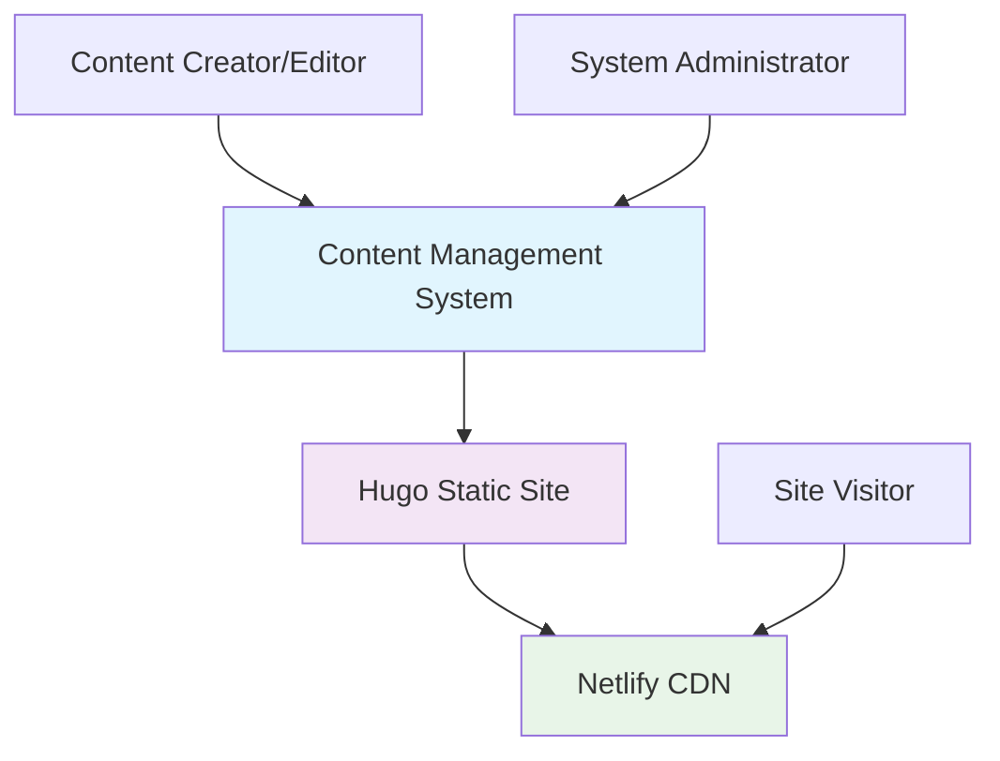

## Level 2: Container Diagram

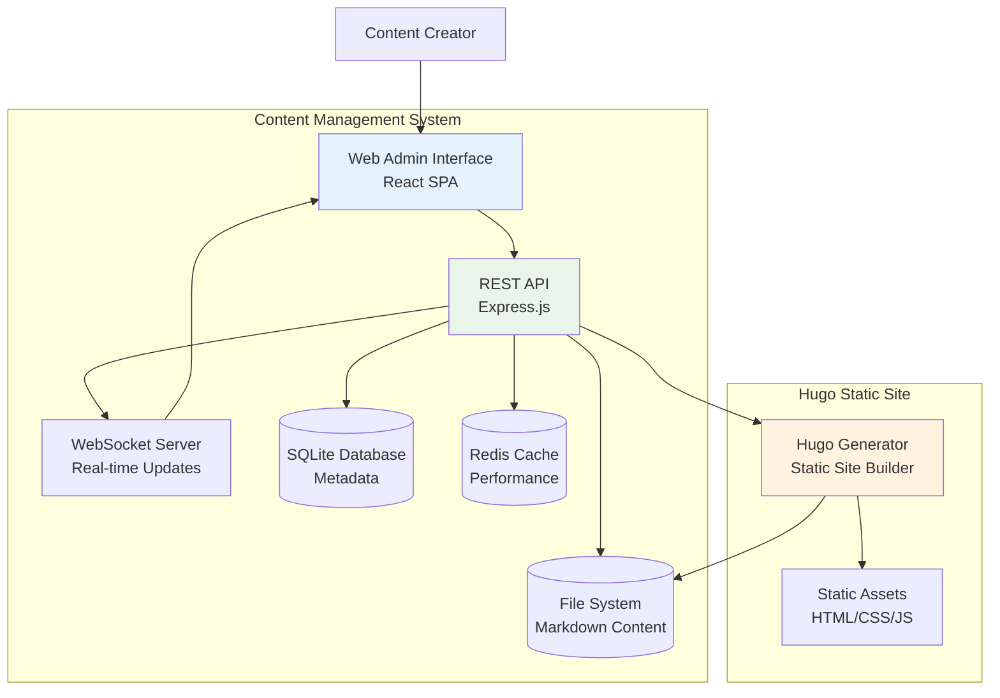

## Level 3: Component Diagram - API Layer

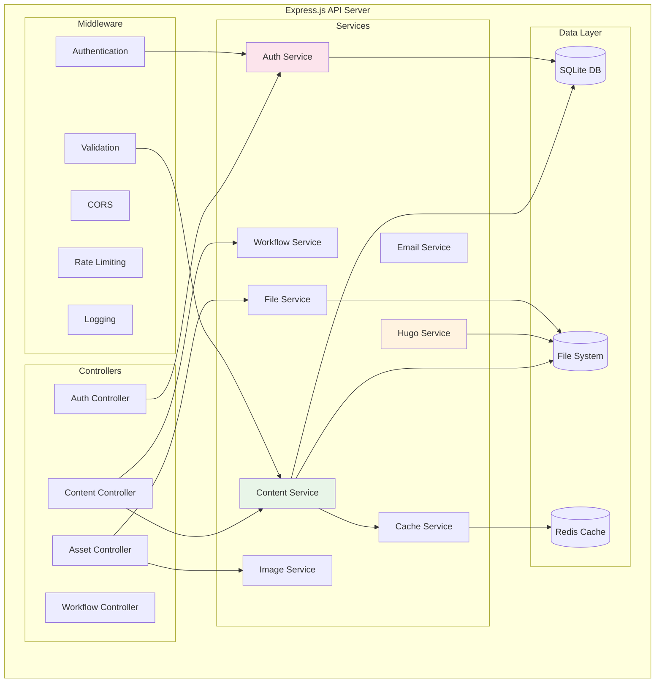

## Data Flow Diagrams

### Content Creation Flow

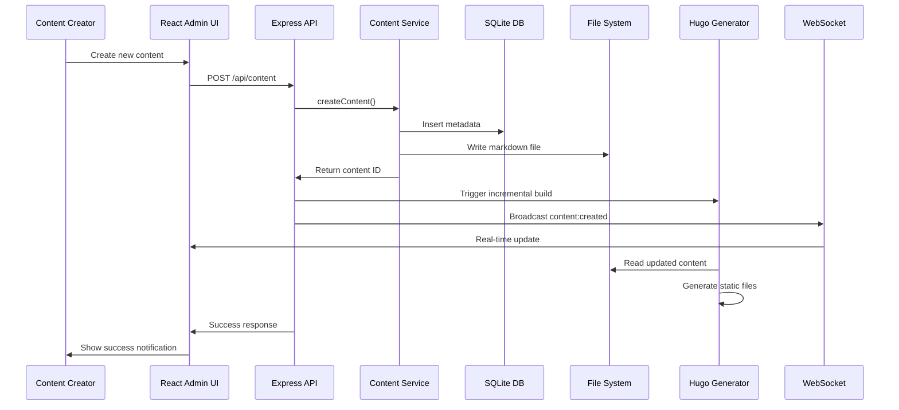

### Content Publishing Workflow

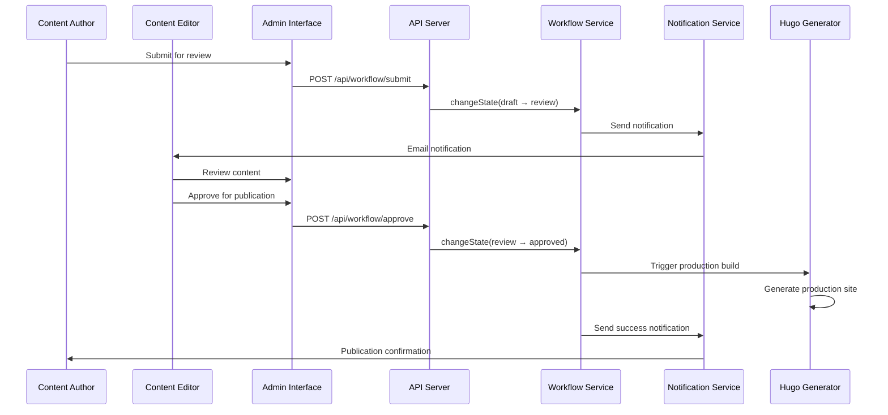

### Asset Upload and Processing Flow

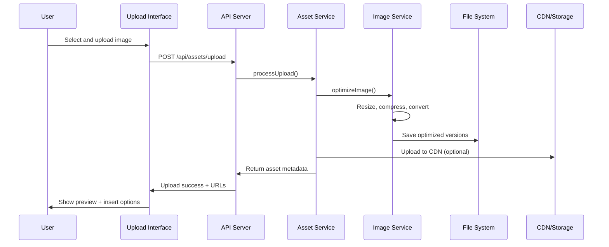

## System Integration Diagram

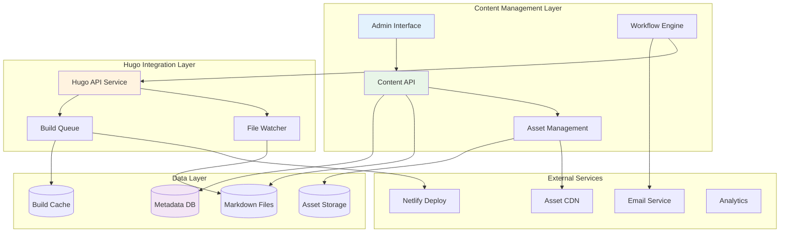

## Service Interaction Matrix

| Service | ContentSvc | HugoSvc | AuthSvc | FileSvc | ImageSvc | CacheSvc | EmailSvc | WorkflowSvc |
|---------|------------|---------|---------|---------|----------|----------|----------|-------------|
| ContentSvc | - | ✓ | ✓ | ✓ | - | ✓ | - | ✓ |
| HugoSvc | ✓ | - | - | ✓ | - | ✓ | - | - |
| AuthSvc | - | - | - | - | - | ✓ | ✓ | - |
| FileSvc | ✓ | ✓ | - | - | ✓ | - | - | - |
| ImageSvc | ✓ | - | - | ✓ | - | ✓ | - | - |
| CacheSvc | ✓ | ✓ | ✓ | - | ✓ | - | - | ✓ |
| EmailSvc | - | - | ✓ | - | - | - | - | ✓ |
| WorkflowSvc | ✓ | ✓ | ✓ | - | - | ✓ | ✓ | - |

## Performance and Scalability Patterns

### Caching Architecture

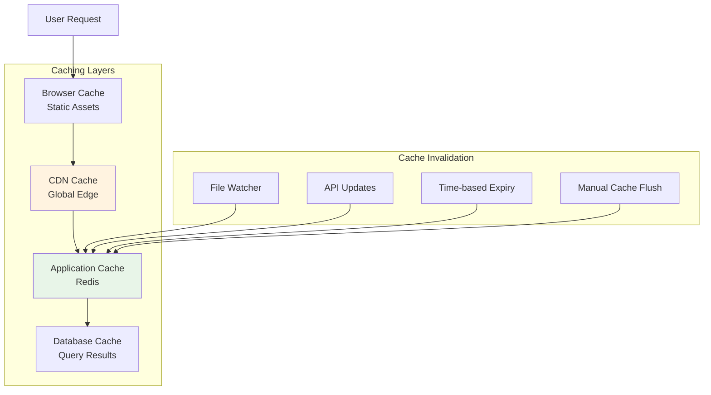

### Load Balancing and Scaling

```mermad
graph TB
    subgraph "Load Balancer"
        LB[Nginx/Cloudflare]
    end
    
    subgraph "Application Servers"
        App1[Node.js Instance 1]
        App2[Node.js Instance 2]
        App3[Node.js Instance 3]
    end
    
    subgraph "Shared Services"
        Redis[(Redis Cache)]
        SQLite[(SQLite DB)]
        FileStore[(Shared File Storage)]
    end
    
    Users[Users] --> LB
    LB --> App1
    LB --> App2
    LB --> App3
    
    App1 --> Redis
    App1 --> SQLite
    App1 --> FileStore
    
    App2 --> Redis
    App2 --> SQLite
    App2 --> FileStore
    
    App3 --> Redis
    App3 --> SQLite
    App3 --> FileStore
    
    style LB fill:#e3f2fd
    style Redis fill:#ffebee
    style SQLite fill:#f3e5f5
```

## Error Handling and Recovery

### Error Flow Diagram

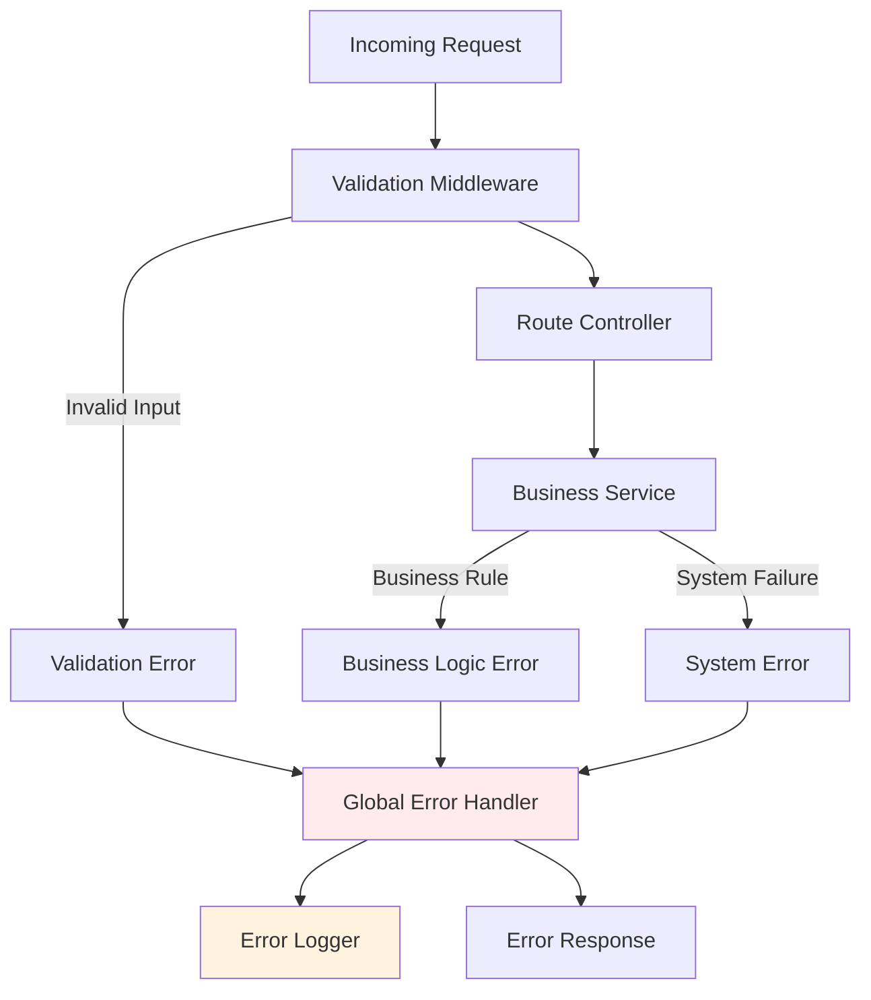

## Security Architecture

### Authentication and Authorization Flow

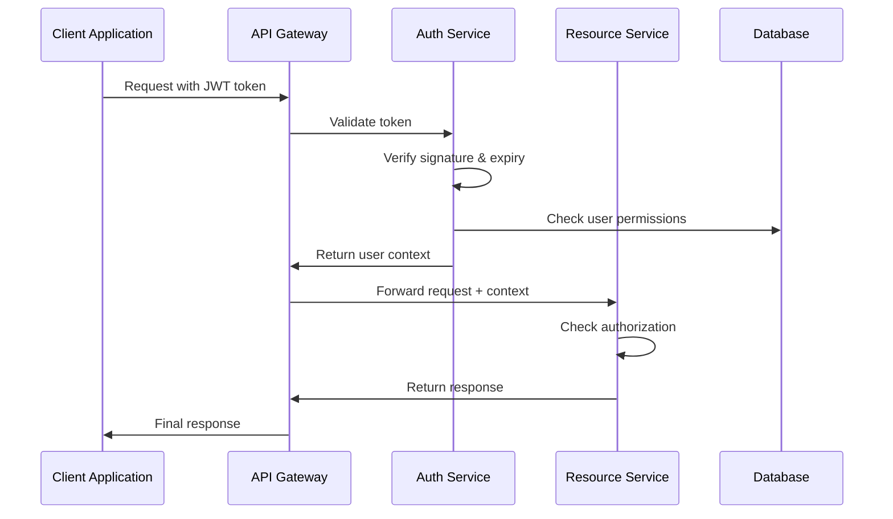

## Monitoring and Observability

### System Health Monitoring

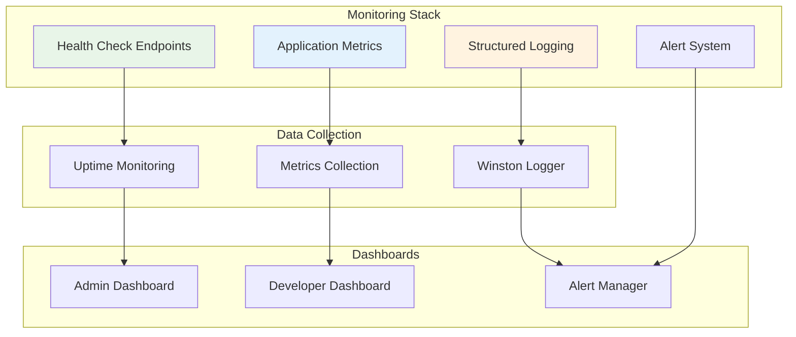

---

*These component diagrams provide a comprehensive view of the system architecture, showing how different components interact and data flows through the system. They serve as a reference for development and help identify potential bottlenecks or areas for optimization.*