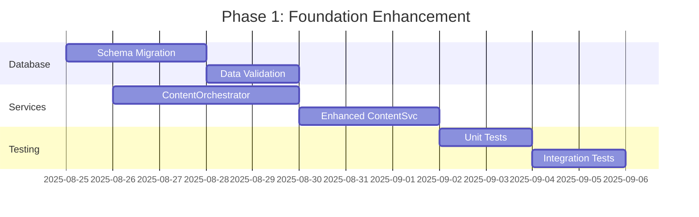
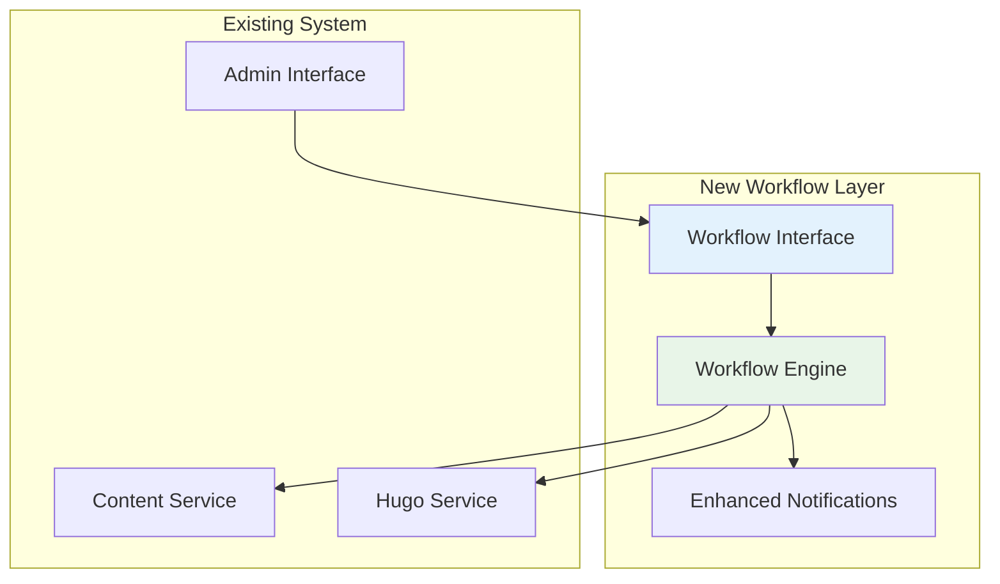
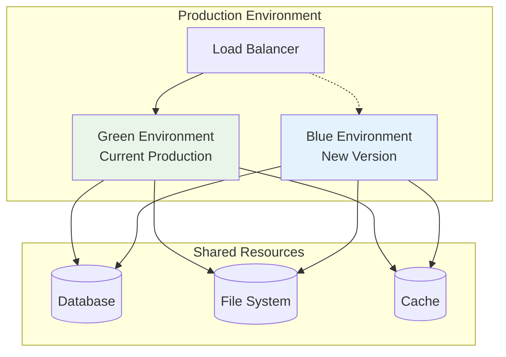

# Integration Strategy
## Hugo Portfolio Site - Content Management System Integration

### Executive Summary

This document outlines the comprehensive integration strategy for implementing the enhanced content management system within the existing Hugo portfolio site infrastructure. The strategy emphasizes minimal disruption to current functionality while providing a clear path to advanced content management capabilities.

## Current System Analysis

### Existing Infrastructure
```
Current State:
├── Hugo Static Site Generator
├── Express.js Backend (10 services)
├── Static Admin Interface
├── Netlify Deployment
├── SQLite + File System Storage
└── Bilingual Content Support (EN/ES)
```

### Integration Challenges
1. **Backward Compatibility**: Maintain existing content structure
2. **Zero Downtime**: Implement changes without service interruption
3. **Data Migration**: Safely migrate existing content and metadata
4. **Performance**: Ensure new features don't impact site performance
5. **User Experience**: Seamless transition for content creators

## Integration Phases

### Phase 1: Foundation Enhancement (Weeks 1-2)

#### Objectives
- Enhance existing services with new capabilities
- Implement core database schema extensions
- Establish transaction management foundation

#### Implementation Steps



#### Database Migration Strategy

```sql
-- Migration Script 001: Core Extensions
-- Add new tables without affecting existing data

-- Transaction management
CREATE TABLE IF NOT EXISTS transactions (
    id TEXT PRIMARY KEY,
    status TEXT NOT NULL DEFAULT 'pending',
    operations TEXT NOT NULL,
    created_at DATETIME DEFAULT CURRENT_TIMESTAMP,
    completed_at DATETIME,
    error_message TEXT
);

-- Enhanced content metadata
ALTER TABLE content_items ADD COLUMN workflow_status TEXT DEFAULT 'draft';
ALTER TABLE content_items ADD COLUMN assigned_to TEXT;
ALTER TABLE content_items ADD COLUMN version INTEGER DEFAULT 1;
ALTER TABLE content_items ADD COLUMN checksum TEXT;

-- Content relationships
CREATE TABLE IF NOT EXISTS content_relationships (
    id TEXT PRIMARY KEY,
    parent_id TEXT NOT NULL,
    child_id TEXT NOT NULL,
    relationship_type TEXT NOT NULL,
    metadata TEXT,
    created_at DATETIME DEFAULT CURRENT_TIMESTAMP,
    FOREIGN KEY (parent_id) REFERENCES content_items(id),
    FOREIGN KEY (child_id) REFERENCES content_items(id)
);

-- Asset management
CREATE TABLE IF NOT EXISTS assets (
    id TEXT PRIMARY KEY,
    filename TEXT NOT NULL,
    original_name TEXT NOT NULL,
    file_path TEXT NOT NULL,
    file_size INTEGER,
    mime_type TEXT,
    dimensions TEXT,
    metadata TEXT,
    upload_date DATETIME DEFAULT CURRENT_TIMESTAMP,
    used_by TEXT -- JSON array of content IDs
);
```

#### Service Enhancement Plan

**ContentOrchestrator Integration**
```javascript
// Gradual integration approach
class EnhancedContentService extends ContentService {
  constructor(orchestrator, ...args) {
    super(...args);
    this.orchestrator = orchestrator;
    this.enableOrchestration = process.env.ENABLE_ORCHESTRATION === 'true';
  }

  async createContent(data) {
    if (this.enableOrchestration) {
      return this.orchestrator.executeTransaction([
        { type: 'create', service: 'content', payload: data },
        { type: 'index', service: 'search', payload: data }
      ]);
    }
    return super.createContent(data);
  }
}
```

### Phase 2: Workflow Implementation (Weeks 3-4)

#### Objectives
- Implement WorkflowEngine service
- Add workflow management to admin interface
- Integrate notification system enhancements

#### Workflow Integration Strategy



#### Default Workflow Configuration

```yaml
# config/workflows/default.yaml
name: "Standard Content Workflow"
description: "Default workflow for content publishing"

states:
  - id: "draft"
    name: "Draft"
    type: "start"
    assignable: true
    notifications:
      - type: "email"
        recipients: ["author"]
        template: "draft_created"

  - id: "review"
    name: "Under Review"
    type: "intermediate"
    assignable: true
    notifications:
      - type: "email"
        recipients: ["editors"]
        template: "review_requested"

  - id: "approved"
    name: "Approved"
    type: "intermediate"
    notifications:
      - type: "email"
        recipients: ["author"]
        template: "content_approved"

  - id: "published"
    name: "Published"
    type: "end"
    notifications:
      - type: "email"
        recipients: ["author", "subscribers"]
        template: "content_published"

transitions:
  - from: "draft"
    to: "review"
    action: "submit_for_review"
    permissions: ["author", "editor"]

  - from: "review"
    to: "approved"
    action: "approve"
    permissions: ["editor", "admin"]

  - from: "review"
    to: "draft"
    action: "request_changes"
    permissions: ["editor", "admin"]

  - from: "approved"
    to: "published"
    action: "publish"
    permissions: ["editor", "admin"]
    automations: ["hugo_build", "cache_clear"]
```

### Phase 3: Asset and Search Enhancement (Weeks 5-6)

#### Asset Management Integration

**Migration Strategy for Existing Assets**
```javascript
// Asset migration script
class AssetMigration {
  async migrateExistingAssets() {
    const staticAssets = await this.scanStaticDirectory('/static/uploads');
    const publicAssets = await this.scanStaticDirectory('/public/uploads');
    
    for (const asset of [...staticAssets, ...publicAssets]) {
      await this.createAssetRecord(asset);
      await this.generateOptimizedVariants(asset);
      await this.updateContentReferences(asset);
    }
  }

  async createAssetRecord(asset) {
    const metadata = await this.extractMetadata(asset);
    const record = {
      id: crypto.randomUUID(),
      filename: asset.filename,
      originalName: asset.originalName,
      filePath: asset.path,
      fileSize: asset.size,
      mimeType: asset.mimeType,
      metadata: JSON.stringify(metadata),
      uploadDate: asset.stats.birthtime
    };

    await this.db.assets.create(record);
    return record;
  }
}
```

#### Search Implementation Strategy

```javascript
// Gradual search index building
class SearchIndexBuilder {
  async buildInitialIndex() {
    const contentItems = await this.contentService.getAllContent();
    const batchSize = 50;
    
    for (let i = 0; i < contentItems.length; i += batchSize) {
      const batch = contentItems.slice(i, i + batchSize);
      await this.indexBatch(batch);
      
      // Allow other operations to proceed
      await new Promise(resolve => setTimeout(resolve, 100));
    }
  }

  async indexBatch(contentItems) {
    const indexOperations = contentItems.map(item => ({
      type: 'index',
      service: 'search',
      payload: this.prepareForIndex(item)
    }));

    await this.orchestrator.executeTransaction(indexOperations);
  }
}
```

### Phase 4: Advanced Features (Weeks 7-8)

#### Real-time Collaboration Features

```javascript
// WebSocket integration for real-time updates
class CollaborationManager {
  constructor(websocketServer, workflowEngine) {
    this.ws = websocketServer;
    this.workflow = workflowEngine;
    
    // Subscribe to workflow events
    this.workflow.on('state_changed', this.broadcastStateChange.bind(this));
    this.workflow.on('content_updated', this.broadcastContentUpdate.bind(this));
  }

  broadcastStateChange(event) {
    const message = {
      type: 'workflow:state_changed',
      data: {
        contentId: event.contentId,
        previousState: event.previousState,
        currentState: event.currentState,
        user: event.user,
        timestamp: Date.now()
      }
    };

    this.ws.broadcast(`content:${event.contentId}`, message);
  }
}
```

## Deployment Strategy

### Blue-Green Deployment Approach



#### Deployment Steps

1. **Pre-deployment Validation**
   - Run comprehensive test suite
   - Validate database migrations
   - Check environment configuration

2. **Blue Environment Setup**
   - Deploy new version to blue environment
   - Run database migrations
   - Warm up caches

3. **Traffic Migration**
   - Gradually shift traffic from green to blue
   - Monitor error rates and performance
   - Maintain rollback capability

4. **Post-deployment Verification**
   - Verify all features working correctly
   - Monitor system performance
   - Update monitoring and alerting

### Database Migration Safety

```javascript
// Safe migration execution
class MigrationRunner {
  async executeMigration(migration) {
    const transaction = await this.db.beginTransaction();
    
    try {
      // Create backup
      await this.createBackup();
      
      // Execute migration
      await this.runMigrationSteps(migration.steps);
      
      // Validate results
      await this.validateMigration(migration.validation);
      
      await transaction.commit();
      this.logger.info(`Migration ${migration.name} completed successfully`);
      
    } catch (error) {
      await transaction.rollback();
      await this.restoreBackup();
      throw new Error(`Migration failed: ${error.message}`);
    }
  }
}
```

## Risk Mitigation

### Technical Risks

| Risk | Impact | Probability | Mitigation Strategy |
|------|--------|-------------|-------------------|
| Data Loss | High | Low | Automated backups, migration validation |
| Performance Degradation | Medium | Medium | Performance testing, gradual rollout |
| Service Downtime | High | Low | Blue-green deployment, rollback procedures |
| Integration Failures | Medium | Medium | Comprehensive testing, feature flags |

### Rollback Procedures

```javascript
// Automated rollback system
class RollbackManager {
  async executeRollback(deploymentId) {
    const deployment = await this.getDeployment(deploymentId);
    
    // Stop new deployments
    await this.pauseDeployments();
    
    // Restore previous version
    await this.restoreApplicationVersion(deployment.previousVersion);
    
    // Restore database if needed
    if (deployment.includesDatabaseChanges) {
      await this.restoreDatabaseBackup(deployment.databaseBackup);
    }
    
    // Clear caches
    await this.clearAllCaches();
    
    // Verify rollback success
    await this.verifyRollbackSuccess();
    
    this.logger.info(`Rollback completed for deployment ${deploymentId}`);
  }
}
```

## Performance Optimization

### Caching Strategy Enhancement

```javascript
// Multi-layer caching implementation
class CacheManager {
  constructor() {
    this.layers = {
      l1: new MemoryCache({ ttl: 300 }), // 5 minutes
      l2: new RedisCache({ ttl: 3600 }), // 1 hour
      l3: new FileCache({ ttl: 86400 })  // 24 hours
    };
  }

  async get(key) {
    // Try L1 cache first
    let value = await this.layers.l1.get(key);
    if (value) return value;

    // Try L2 cache
    value = await this.layers.l2.get(key);
    if (value) {
      await this.layers.l1.set(key, value);
      return value;
    }

    // Try L3 cache
    value = await this.layers.l3.get(key);
    if (value) {
      await this.layers.l2.set(key, value);
      await this.layers.l1.set(key, value);
      return value;
    }

    return null;
  }
}
```

### Database Optimization

```sql
-- Performance indexes for new tables
CREATE INDEX idx_content_workflow_status ON content_items(workflow_status);
CREATE INDEX idx_content_assigned_to ON content_items(assigned_to);
CREATE INDEX idx_content_checksum ON content_items(checksum);
CREATE INDEX idx_relationships_parent ON content_relationships(parent_id);
CREATE INDEX idx_relationships_child ON content_relationships(child_id);
CREATE INDEX idx_assets_usage ON assets(used_by);
CREATE INDEX idx_workflow_instances_content ON workflow_instances(content_id);
CREATE INDEX idx_workflow_instances_state ON workflow_instances(current_state);
```

## Monitoring and Observability

### Health Check Implementation

```javascript
// Comprehensive health checks
class HealthChecker {
  async checkSystemHealth() {
    const checks = await Promise.allSettled([
      this.checkDatabase(),
      this.checkFileSystem(),
      this.checkCache(),
      this.checkExternalServices(),
      this.checkWorkflowEngine(),
      this.checkSearchEngine()
    ]);

    const results = checks.map((check, index) => ({
      service: this.serviceNames[index],
      status: check.status === 'fulfilled' ? 'healthy' : 'unhealthy',
      details: check.value || check.reason
    }));

    return {
      overall: results.every(r => r.status === 'healthy') ? 'healthy' : 'degraded',
      services: results,
      timestamp: new Date().toISOString()
    };
  }
}
```

### Performance Monitoring

```javascript
// Real-time performance tracking
class PerformanceMonitor {
  constructor() {
    this.metrics = new Map();
    this.thresholds = {
      responseTime: 2000, // 2 seconds
      errorRate: 0.05,    // 5%
      memoryUsage: 0.85   // 85%
    };
  }

  trackRequest(req, res, next) {
    const start = Date.now();
    
    res.on('finish', () => {
      const duration = Date.now() - start;
      this.recordMetric('response_time', duration);
      
      if (res.statusCode >= 400) {
        this.recordMetric('error_count', 1);
      }
      
      this.checkThresholds();
    });
    
    next();
  }

  checkThresholds() {
    const avgResponseTime = this.getAverageMetric('response_time');
    if (avgResponseTime > this.thresholds.responseTime) {
      this.alertManager.sendAlert('high_response_time', {
        current: avgResponseTime,
        threshold: this.thresholds.responseTime
      });
    }
  }
}
```

## Success Metrics

### Technical Metrics
- **Build Time**: Reduce Hugo build time by 60%
- **Response Time**: Maintain <200ms API response times
- **Uptime**: Achieve 99.9% system availability
- **Error Rate**: Keep error rate below 0.1%

### User Experience Metrics
- **Content Creation Time**: Reduce by 40%
- **Publishing Workflow**: Reduce approval time by 50%
- **Search Accuracy**: Achieve >90% relevant results
- **User Satisfaction**: >4.5/5 rating from content creators

### Business Metrics
- **Content Volume**: Support 10x content growth
- **User Adoption**: 100% of content creators using new system
- **Feature Utilization**: >80% of new features actively used
- **Maintenance Time**: Reduce by 30%

---

*This integration strategy provides a comprehensive roadmap for implementing the enhanced content management system while minimizing risk and ensuring a smooth transition from the current architecture to the target state.*